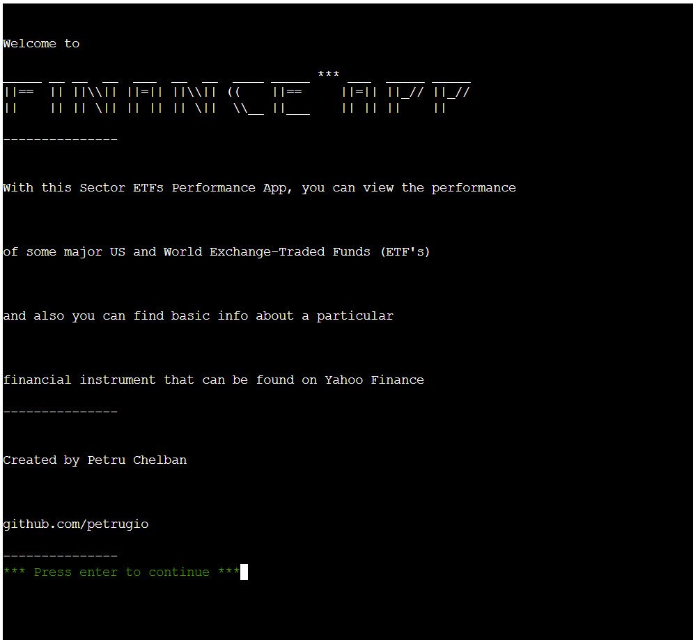
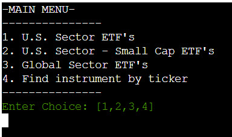
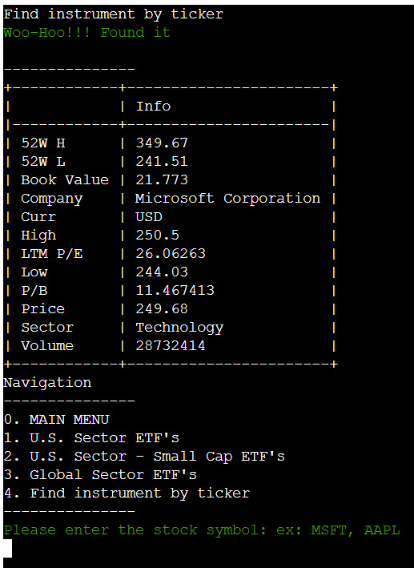
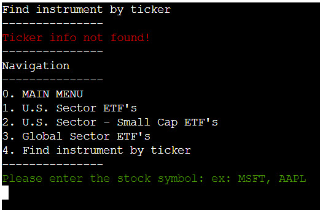
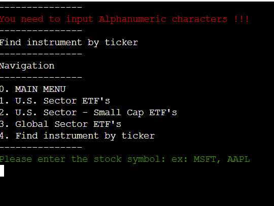
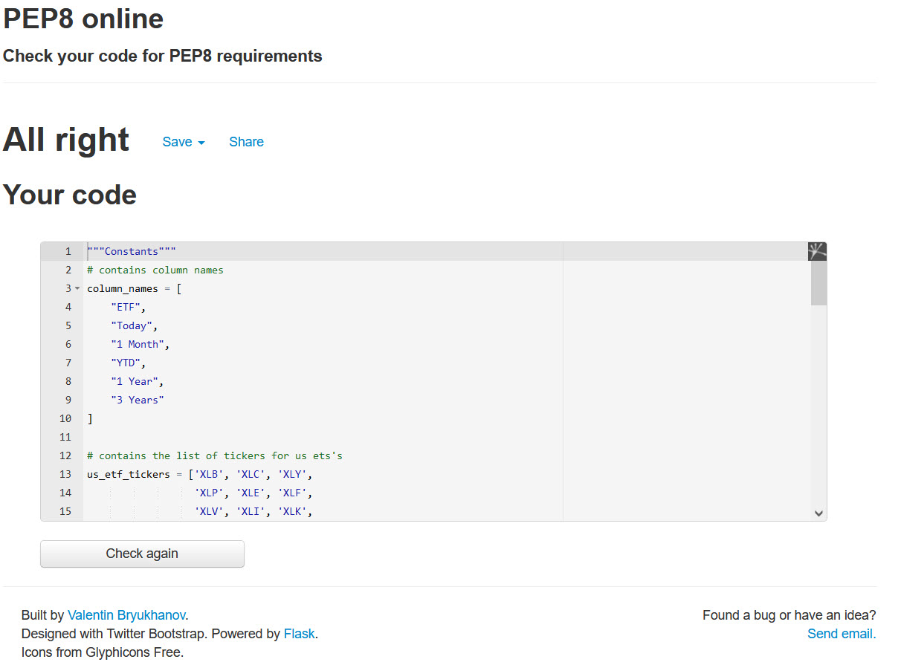
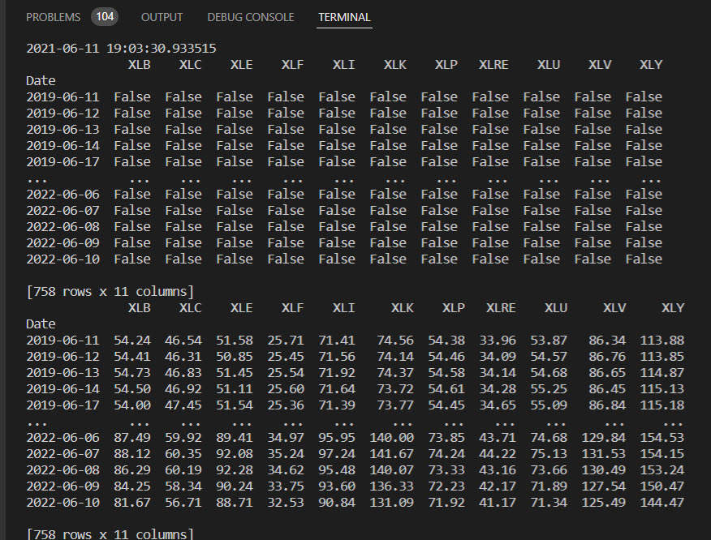
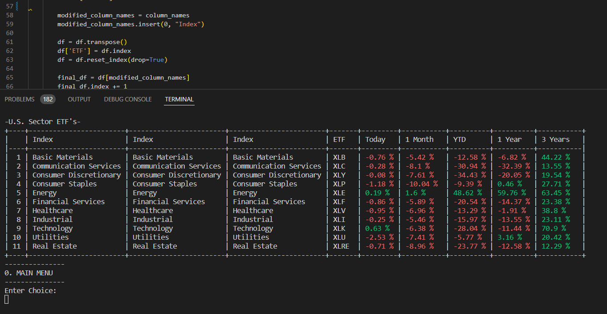
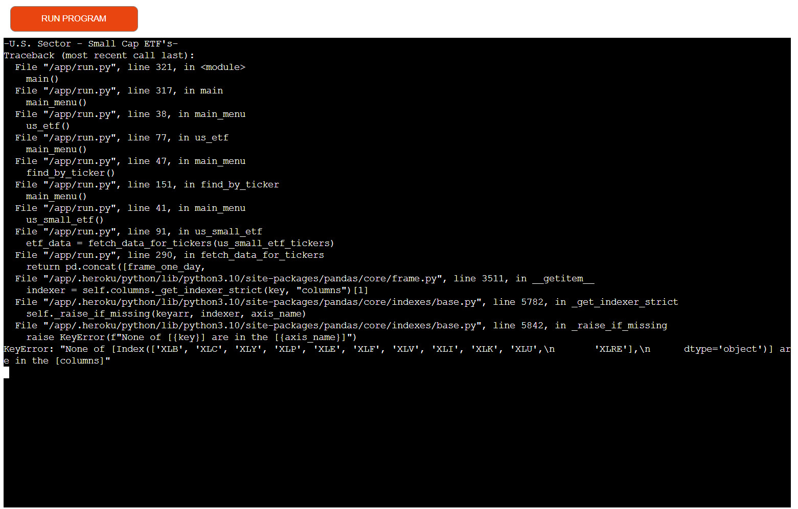
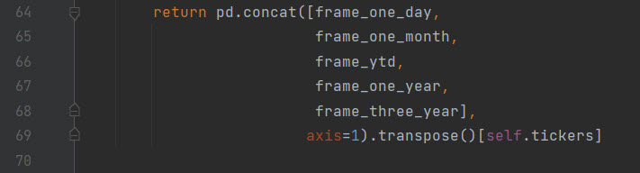

<h1 align="center">ETF Finance App</h1>

View the repository in GitHub
<a href="https://github.com/petrugio/finance-app" target="_blank" rel="noopener">here</a>

View the live project
<a href="https://etf-finance-app.herokuapp.com/" target="_blank" rel="noopener">here</a>

TEST

ERRORS

replicate this with python

https://seekingalpha.com/etfs-and-funds/etf-tables/sectors

used

https://pypi.org/project/yfinance/
https://pypi.org/project/termcolor/
https://pandas.pydata.org/docs/getting_started/index.html
https://numpy.org/install/
https://pypi.org/project/art/

code example and fixes

https://blog.quantinsti.com/stock-market-data-analysis-python/

https://towardsdatascience.com/financial-data-from-yahoo-finance-with-python-b5399743bcc6

https://stackoverflow.com/questions/42739327/iloc-giving-indexerror-single-positional-indexer-is-out-of-bounds

https://pandas.pydata.org/pandas-docs/stable/user_guide/timeseries.html#offset-aliases

https://pandas.pydata.org/pandas-docs/version/0.23.3/generated/pandas.DataFrame.pct_change.html

https://snyk.io/advisor/python/yfinance/example

https://stackoverflow.com/questions/62123237/python-pandas-data-not-aligned-correctly

https://marqueegroup.ca/resource/how-to-use-python-in-a-finance-environment/

https://discuss.python.org/t/creating-an-application-to-pull-stock-data-from-yfinance/9605

https://www.tutorialgateway.org/python-program-to-check-character-is-alphabet-or-digit/

https://www.w3schools.com/python/python_dictionaries_access.asp

https://stackoverflow.com/questions/29767310/pythons-lambda-with-underscore-for-an-argument

https://stackoverflow.com/questions/22029562/
    python-how-to-make-simple-animated-loading-while-process-is-running
    
https://stackoverflow.com/questions/983354/how-to-make-a-python-script-wait-for-a-pressed-key
	

animation

 https://stackoverflow.com/questions/22029562/
    python-how-to-make-simple-animated-loading-while-process-is-running

