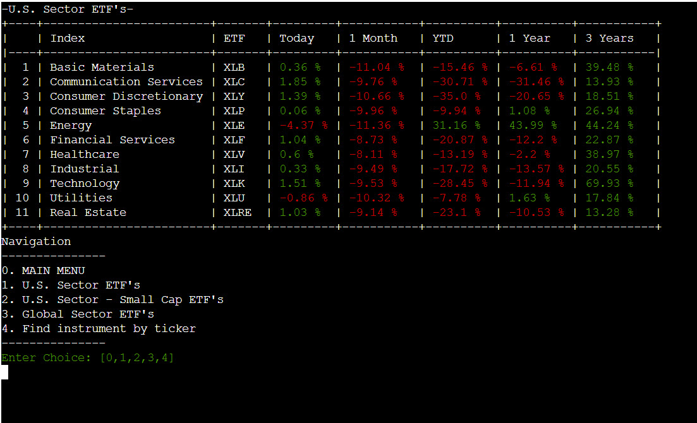
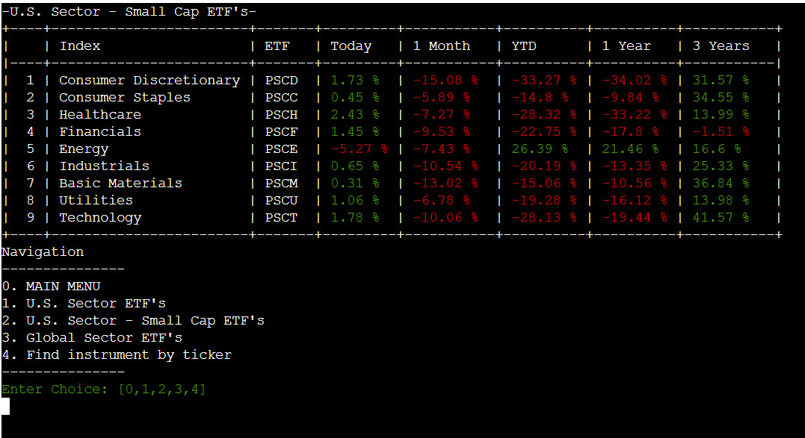
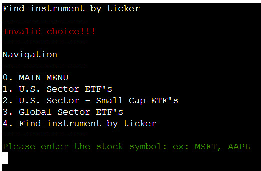
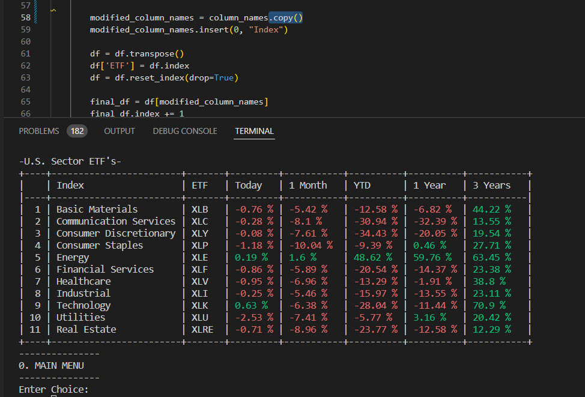
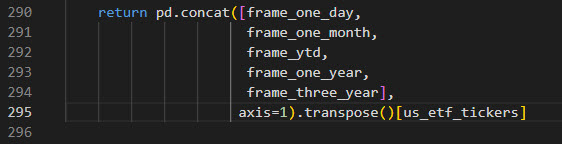
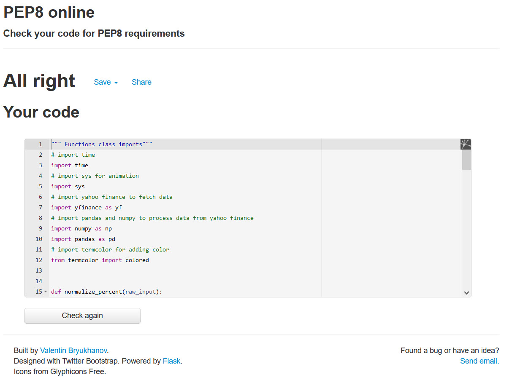

<h1 align="center">ETF Finance App</h1>

View the repository in GitHub
<a href="https://github.com/petrugio/finance-app" target="_blank" rel="noopener">here</a>

View the live project
<a href="https://etf-finance-app.herokuapp.com/" target="_blank" rel="noopener">here</a>

# **ETF Finance App**

ETF Finance App, is a Python terminal app that runs on Heroku.

ETF Finance App is a replication of [seekingalpha.com](https://seekingalpha.com/etfs-and-funds/etf-tables/sectors) Sector ETFs page in Python.

This App fulfills 2 goals: PP3 with Code Institute and my long waited ability to access, process, analyze and display financial markets data.

## How to use the App

* Upon opening the App the User is greeted by Welcome page  
* After pressing enter the User is presented with main menu
* On option 1 to 3 the User has the ability to view the performance of major ETFs
* On option 4 the User has the ability to input desired financial instrument ticker and have some basic information about this ticker displayed. 

## User Experience (UX)

### User Stories

Target Audience – people that have a interest in Financial Markets and want a general overview of majors stock market sectors or a particular financial instrument 

As a User I want to:
* understand how to use the app
* navigate the app
* know on which section of the app am I located on
* know when I have entered something in an incorrect format and understand why
* have the information intuitively displayed on the screen

### User Experience in this Game
This app takes the users' stories mentioned above into consideration to create a positive UX.  The user's experience explained in more detail below with examples in the Features Sections.

## Features

**Welcome screen:**

* [Art](https://pypi.org/project/art/) was installed and `from art import *` was used to generate ASCII art for the title of the app.

* Standard Font was used for the title. This was used to give the user clarity of what the app is called.

* A short description of the app is displayed bellow the title.

* The author's name and GitHub page was added separated from the description with dashed lines.

* A colored message was added to the bottom to let the user know what actions are required continue.  

    

**Main menu:**

* The user is presented with the main menu which consist of numbered sections of the app.
* The navigation is done by inputting the number corresponding to the required section of the app.  
* A colored requirement and choice options are presented to let the user know how to continue. 

    

**Wrong input:**

* If the user inputs anything else than the required navigation options an colored error message is displayed letting the user know that this is the wrong input.

    

**Major ETFs Screens**

*  When the user selects options 1 to 3 he/she is presented with corresponding screen with performance information displayed.

*  The steps to display the information are as follow:
   
   - Corresponding `etf()` function gets called
   - This function assigns to the class `Crawler` the corresponding lists on ETF tickers and tickers names list from the file `constants`
   - Class Crawler takes the list, fetches the data from Yahoo Finance, does the percent change calculations and returns the processed data back to the  `etf()` function
   - The data is printed in a table format

* The information is presented with clear and descriptive columns and rows for different periods.

* The performance is presented in percent(%) terms and color coded with intuitively red and green colors which are commonly associated with positive and negative values in the financial markets.

* A navigation menu is presented below the table and has an extra option to give the user the ability to return to the main screen.

    
    
    
    

**Find instrument**

* This screen also contains the navigation.

* If the user enters a valid navigation section number the app will navigate to that particular section.

* Also it will display the basic info about a particular financial instrument that can be found on Yahoo Finance.

* The input requirements are colored green to draw attention of the user and let the user know the correct format of the input.

    

* If the user inputs a ticker which consists of an alphabetic character or up to 5 alphabetic character series, the app will search Yahoo Finance and if ticker found it will display in a table the short info about this particular financial instrument associated with this ticker.

    
    
**Searching**

* A animation function was added to simulate the ticker searching process and give progress feedback to the user.
   
    

**Wrong input number**

* If the user inputs wrong numerical value an error message is displayed letting the user know that the input navigation choice is incorrect.

    

**Wrong input letter**

* If the user inputs anything else that alphabetic or numerical characters, an error message will appear letting the user know that this is the wrong input.  

    

**Wrong input ticker**

* If the user inputs a valid alphabetic character or up to 5 alphabetic character series and it cannot be found on Yahoo Finance, an error message will appear letting the user know that the ticker cannot be found.  

    

### Future Development & Features Left to Implement

* This is only proof of concept version of this app.
* In future versions I plan to implement different options including:

    - Get financial instruments from a more reliable data source, ex: [Nasdaq Data Link]( https://data.nasdaq.com/)  
    - Ability to get data and group by different sectors, sub sectors.
    - Ability to select custom time interval for performance.
    - Ability to display data , ex: using [Matplotlib]( https://matplotlib.org/)( see section wireframes)
    - Ability for alerts when a specific condition on a specific list of instruments is met.
    - Ability to have the alerts sent to user via different methods, ex: Email, Telegram, Discord.

### Data Model Design

**Use Case Diagram and Flow Control**

A combination of Flow Control and Unified Modelling Language (UML) was used to visualize the various features and control flow statements of the app.

* The Diagram was drafted to capture the app's functionality and relationships with the user.

* The relationship with the User starts at Welcome screen. All 6 screens of the app are represented by orange squares. The relation between screens are represented by arrows with numbers which represent navigation options. 
* The Diagram shows the order in which individual instructions were executed and the result that followed.

* This also allowed the design of the user input validation checks to be visually clear before the code was written.

**Wireframes**

Wireframes were drawn to have the basic idea of what needs to be build.

**Future Development Wireframes**

As discussed in Future Development section above, this is a potential development in the future.

**Classes and functions**

* During the development in order to minimize redundant code I decided to group various if statements into functions and then into a class called *Crawler*. The class diagram below shows what class does.
The class and its associated methods are stored in separate file to allow for separating the code into parts that hold related data and functionality.  
 
* List with tickers and ETFs were extracted to external file called *constants*.   
* Some functions were also moved to an eternal file called *functions* to make the code more modular.
* This will allow any future expansion and development of this project to have a clear structure and also for any code re-use and sharing as well as maintenance.

**Colour**

To change the text color [Termcolor](https://pypi.org/project/termcolor/) was imported.  

A mix of red and green was used to keep the app intuitive give feedback to the Users. 

## Libraries & Technology Used

**Python Libraries**
* pip 

    pip install was used to install Python Libraries via terminal using the command `pip install 'package name'` to install packages in gitpod.
    
    The command `pip3 freeze > requirements.txt` was used to install dependencies for proper deployment on heroku. 
* os

    The os library was imported to create a function to utilize the os.system to clear the terminal.  This supports a positive user experience and making the screen clearer and more structured.
    
* time and datetime 

    Time and Datetime was used for calculating the time periods and in animation function.
    
* tabulate

    Was used to display the data in a table format.
    
* Yahoo Finance (yfinance)

    yfinance was used to get the data for financial instruments from Yahoo Finance website
    
* pandas 
    
    pandas dataframe was used to manipulate the data.
    
* numpy 

    numpy was used for adding the percent (%) sign to the calculated data before displaying.
    
* art
    
    was used to generate ASCII art for the title of the app.

* [LucidCharts](https://www.lucidchart.com/) was used to create the UML Case Diagram and the Flowchart.

* [Draw.io](https://www.Draw.io) to draw Class Diagram.

* Snagit to convert, edit, crop and save images screen recordings.

## Testing
*   Methods such as print() as the code developed was used to check for errors.  This helped check that everything was behaving as expected.

*   Errors or warnings were fixed as they appeared such as indentation errors, lines too long or extra space issues.  This helped keep the code clean and readable so other errors or bugs that arose were identified more easily.

*   After deployment all features were checked on Chrome, Firefox, Brave and Edge.

*   The app was deployed early on in development and checked regularly to ensure app working corectly and any errors were handled early on.

*   Testing inputs were used to ensure user inputs would be handled correctly and appropriate feedback to the user was shown on screen.  As mentioned above in the Features Section for how user inputs were handled.

    *   Welcome screen:
    This will accept any input before the enter key is pressed, but makes no use of any input apart from the enter key which calls the main menu function.

    *   App Navigation:
    To test, keys from 1 to 4 from Main menu and 0 to 4 from sub-menus were pressed resulting in navigation to that specific page. Any other input results in `Invalid choice !!!` error message being displayed.

    *   Percent change:
    To test that is calculated correctly the entire dataframe for the specific period was printed to the terminal and then manually calculating the percent change using Windows calculator.

    *   Find by ticker:
    
           To test the input and return of this function steps were as follow:
           - Numbers 0 to 4 were inputted - resulting in Navigation to that specific page -> works as intended.
           - Negative and bigger than 4 numbers were inputted - results in `Invalid choice !!!` error message -> works as intended.
           - Up to 5 letters being inputted and ticker found - displays ticker info -> works as intended.
           - Up to 5 letters being inputted and ticker not found -  results in `Ticker info not found !!!` error message -> works as intended.
           - Non alphanumeric being inputted - results in `You need to input Alphanumeric characters !!!` error message -> works as intended.
           - More than 5 letters being inputted - results in `Ticker should be up to 5 letters !!!` error message -> works as intended.
           - A catch all error clause for unpredictable user inputs was added to prevent the app crashing from *inventive* users:
           
           
           
  
 
### Bugs Found

**1.  Fetch error:**

During development, incorrectly specifying the date resulted in getting False values in the dataframe.

It was solved by looking at [examples](https://towardsdatascience.com/financial-data-from-yahoo-finance-with-python-b5399743bcc6) on how to query `yfinance` to get the data for specific time period.

**2.  Index error**

During code refactoring a duplication/addition of table indexes occurred when navigating between pages:

It was fixed by adding `.copy()` at the end of the line. 

**3. Transpose error**

*  During development while trying to add the 2nd and 3rd list of ETFs run into a key error:  

was fixed by building a separate function for it:

     def __init__(self, tickers, ticker_names):
            """
            Check and formats the data
            """
            self.tickers = tickers if isinstance(
                tickers, (list, set, tuple)) else tickers.replace(',', ' ').split()
            self.ticker_names = ticker_names

**4. Period error**

Since the app was developed during the weekdays an unpredictable error occurred while using the app in the weekend.
Good that error handling message pinpointed where is the problem: `Something bad happened while processing data!`, it was in the class Crawler.
Financial markets are closed during weekend, hence there is no data. While refactoring `today = date.today()` was used to calculate previous period. It works for all periods except for the previous day. Therefore the code to calculate previous day was reverted to the version before refactor in order to work properly.  
In the the future code may be refactored to handle this exception but for time being it is working as intended.

And this is the fix:

### Validator Testing

[pep8 online](http://pep8online.com/) was used for validating the python files.  All python files were checked with no errors reported.

## Deployment

The site was deployed via [Heroku]( https://id.heroku.com/login), and the live link can be found here: [Finance App](https://etf-finance-app.herokuapp.com/) 

This project was developed utilizing the [Code Institute Template]( https://github.com/Code-Institute-Org/python-essentials-template).  Some of the deployment steps below are specifically required for the new CI template and may not be applicable to older versions, or different projects.

Before deploying to Heroku pip3 freeze > requirements.txt was used to install dependencies.

1.	Log in to [Heroku]( https://id.heroku.com/login) or create an account if required.
2.	Then, click the button labeled **New** from the dashboard in the top right corner and from the drop-down menu select **Create New App**.
3.	You must enter a unique app name, (I used etf-finance-app).
4.	Next, select your region, (I chose Europe as I am in Ireland).
5.	Click on the **Create App** button.
6.	The next page you will see is the project’s Deploy Tab.  Click on the **Settings Tab** and scroll down to **Config Vars**.
7.	Click **Reveal Config Vars** and enter **port** into the **Key** box and **8000** into the **Value** box and click the **Add** button.
8.	Next, scroll down to the Buildpack section click **Add Buildpack** select **python** and click **Save Changes**.
9.	Repeat step 8 to add **node.js**.
o	**Note:** The Buildpacks must be in the correct order. If not click and drag them to move into the correct order.
10.	Scroll to the top of the page and now choose the **Deploy** tab.
11.	Select **Github** as the deployment method.
12.	Confirm you want to connect to GitHub.
13.	Search for the repository name and click the connect button.
14.	Scroll to the bottom of the deploy page and select preferred deployment type:

* Click either **Enable Automatic Deploys** for automatic deployment when you push updates to Github.

* Select the correct branch for deployment from the drop-down menu and click **Deploy Branch** for manual deployment.

### Version Control
*   Git was used as the version control software. Commands such as git add ., git status, git commit and git push were used to add, save, stage and push the code to the GitHub repository where the source code is stored.

* [GitKraken](https://www.gitkraken.com/) was also used for git version control when working locally from my PC.

## Credits

Some helpful tutorials I used to help me with coding some of the design ideas were:

**Documentation used**

https://pypi.org/project/yfinance/

https://pypi.org/project/termcolor/

https://pandas.pydata.org/docs/getting_started/index.html

https://numpy.org/install/

https://pypi.org/project/art/

**Code example and fixes**

https://blog.quantinsti.com/stock-market-data-analysis-python/

https://towardsdatascience.com/financial-data-from-yahoo-finance-with-python-b5399743bcc6

https://stackoverflow.com/questions/42739327/iloc-giving-indexerror-single-positional-indexer-is-out-of-bounds

https://pandas.pydata.org/pandas-docs/stable/user_guide/timeseries.html#offset-aliases

https://pandas.pydata.org/pandas-docs/version/0.23.3/generated/pandas.DataFrame.pct_change.html

https://snyk.io/advisor/python/yfinance/example

https://stackoverflow.com/questions/62123237/python-pandas-data-not-aligned-correctly

https://marqueegroup.ca/resource/how-to-use-python-in-a-finance-environment/

https://discuss.python.org/t/creating-an-application-to-pull-stock-data-from-yfinance/9605

https://www.tutorialgateway.org/python-program-to-check-character-is-alphabet-or-digit/

https://www.w3schools.com/python/python_dictionaries_access.asp

https://stackoverflow.com/questions/29767310/pythons-lambda-with-underscore-for-an-argument

https://stackoverflow.com/questions/983354/how-to-make-a-python-script-wait-for-a-pressed-key
	

**Animation**

  
  Animation inspired from [stackoverflow](https://stackoverflow.com/questions/22029562/)

## Acknowledgements

A big shout out to [Code Institute](https://codeinstitute.net/ie/) for providing me with the opportunity to create this project.

I'd like to thank my mentor [Daisy McGirr](https://github.com/Daisy-McG) for invaluable guidance and for reviewing my website.

This project was made possible due to the Google Search.
